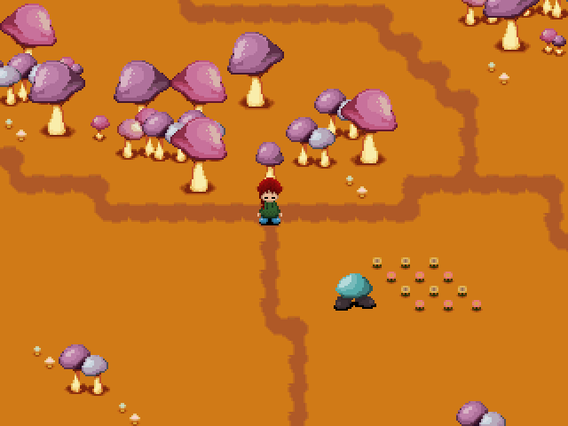

# Mushroom World

[Yume 2kki](https://yume.wiki/2kki/Yume_2kki)'s [Mushroom World](https://yume.wiki/2kki/Mushroom_World) recreated in [Libre Nikki](https://github.com/libre-nikki-devs/libre-nikki) for testing purposes.

| Mushroom World                                           |
|----------------------------------------------------------|
|  |

## Installing

* Clone the Libre Nikki's repository:
  ```sh
  git clone https://github.com/libre-nikki-devs/libre-nikki
  ```
* Clone this repository:
  ```sh
  git clone https://github.com/libre-nikki-devs/mushroom-world
  ```
* Change the current directory to `mushroom-world/`:
  ```sh
  cd mushroom-world/
  ```
* Copy `music/`, `pictures/`, `scenes/`, `scripts/`, `spritesheets/` and `tilesets/` to `../libre-nikki/`:
  ```sh
  cp -r music/ pictures/ scenes/ scripts/ spritesheets/ tilesets/ ../libre-nikki/
  ```
* Open Godot Engine and import Libre Nikki.

* Mushroom World can be accessed directly from Godot Editor or by navigating to **Player Menu > Travel Menu > Mushroom World** in-game in debug builds.

## Licensing

Source code is in public domain. Assets used in this repository belong to Yume 2kki Developers.
